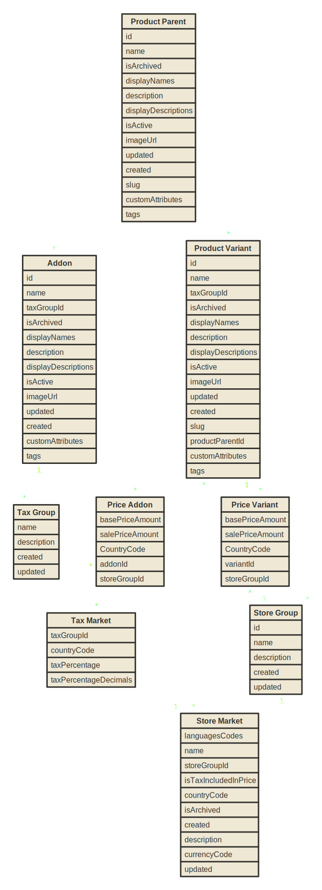

# Brink Commerce Java Client

An unofficial open-source Java client for [Brink Commerce](https://brinkcommerce.com). The client mirrors the
HTTP API and uses `java.net.http` for communication, no additional logic has
been added to the API. **Java 17 is required**. The official documentation can be
found [here](https://docs.brinkcommerce.com).

## Content

1. [Include the artifact in you project](#Dependency)
2. [Initialize Client](#Initialize-Client)
3. [API Documentation and Examples](#API-Documentation)

## Dependency

### Maven

Run `$ mvn install` and add the following to your `pom.xml`:

```xml

<dependency>
  <groupId>dev.yacc</groupId>
  <artifactId>brink-commerce-client</artifactId>
  <version>1.0.1</version>
</dependency>
```

### Gradle

Add the following to your `build.gradle`:

```groovy
dependencies {
    compile 'dev.yacc:brink-commerce-client:1.0.1'
}
```

---

## Initialize Client

### Mangement API

```java
 final ManagementAuthentication auth = ManagementAuthentication.builder()
        .withClientId("<client-id>")
        .withClientSecret("<client-secret>")
        .withTokenUrl(URI.create("<token-url>"))
        .withApiKey("<api-key>")
        .build();

final ManagementConfiguration config = ManagementConfiguration.builder()
        .withHost("<host>")
        .withTimeoutInSeconds(30)
        .withAuthenticationConfiguration(auth)
        .build();

final BrinkManagement management = BrinkCommerce.management(config);
```

### Shopper API
```Java
final ShopperConfiguration config = ShopperConfiguration.builder()
        .withHost("<host>")
        .withTimeoutInSeconds(30)
        .withAuthenticationConfiguration(auth)
        .build();

final BrinkShopper shopper = Brink.shopper(config);
```


## API Documentation
Below is a tree structure describing the available resources in the Java Client. Each resource have different HTTP methods implemented. Also, an UML diagram of how the data models are connected to each other.

```
BrinkCommerce
├── Management
│   ├── Product
│   │   ├── Parent
│   │   ├── Variant
│   │   └── Addon
│   ├── Price
│   │   ├── Variant
│   │   └── Addon
│   ├── Stock
│   │   ├── Inventory
│   │   ├── Variant
│   │   └── Group
│   ├── Tax
│   │   ├── Group
│   │   └── Market
│   └── Discount
│       └── Code
└── Shopper
    ├── Price
    └── Stock
```



### Product Parent

```java
// Create a new Product Parent
private BrinkProductParent createProductParent(final BrinkManagement management) {
  final Map<String, String> customAttributes = Map.of(
           "slug-en","pm-12343-cleveland-puffer-jacket-green-green",
           "slug-sv","pm-12343-cleveland-tackjacka-gron-gron");
   
  final Map<String, String> displayDescriptions = new HashMap<>();
           Map<String, String> displayNames = Map.of(
           "sv", "Cleveland Täckjacka Grön",
           "en", "Cleveland Puffer Jacket Green));
   
  final Map<String, List<String>> tags = Map.of(
           "COLOR", List.of("BLUE", "RED"),
           "BRAND", List.of("Kuling"),
           "MAIN-CATEGORY", List.of("OUTERWEAR"),
           "CATEGORY", List.of("COATS AND JACKETS"),
           "SUBCATEGORY", List.of("PUFFER JACKETS"));
   
  final BrinkProductParent parent = BrinkProductParent.builder()
           .withId("419946")
           .withCustomAttributes(customAttributes)
           .withDescription("Cleveland Puffer Jacket Green")
           .withDisplayDescriptions(displayDescriptions)
           .withDisplayNames(displayNames)
           .withImageUrl("https://images.prod.babyshopgroup.io/images/PM-12343%23a/1024x1024.jpeg")
           .withIsActive(true)
           .withName("Cleveland Puffer Jacket Green")
           .withSlug("pm-12343-cleveland-puffer-jacket-green-green")
           .withTags(tags)
           .build();

  return management.product().parent().create(parent);
}

// Fetch Product Parent
private BrinkProductParent getProductParent(final BrinkManagement management) {
  return management.product().parent().get("419946");
}

// Update Product Parent
private BrinkProductParent updateProductParent(final BrinkManagement management, final BrinkProductParent updatedParent) {
  return management.product().parent().update(updatedParent);
}

// Delete Product Parent
private void deleteProductParent(final BrinkManagement management, final String parentId) {
  final BrinkProductParent parent = management.product().parent().delete(parentId);
}
```


### Product Variant

```java
// Create a new Product Variant
private BrinkProductVariant createProductVariant(final BrinkManagement management,
   final Map<String, String> customAttributes,
   final Map<String, String> displayNames,
   final Map<String, List<String>> tags) {
   
   return management.product().variant().create(BrinkProductVariant.builder()
     .withProductParentId("419946")
     .withId("419946-1")
     .withDimensions(BrinkDimensions.builder()
       .withHeight(296)
       .withWidth(432)
       .withLength(141)
       .build())
     .withWeight(685)
     .withDescription("Cleveland Puffer Jacket Green 74/80 cm")
     .withCustomAttributes(customAttributes)
     .withDisplayDescriptions(displayNames)
     .withTags(tags)
     .withName("Cleveland Puffer Jacket Green 74/80 cm")
     .withTaxGroupId("CLOTHING-CM-146X2F152")
     .withDisplayNames(displayNames)
     .withImageUrl("https://images.prod.babyshopgroup.io/images/PM-12343%23a/1024x1024.jpeg")
     .withIsActive(true)
     .withIsArchived(false)
     .build());
}
```

### Price

```java
private BrinkPriceVariantListResponse createPrice(final BrinkManagement management, final String variantId) {

   final BrinkPriceVariant priceVariant = BrinkPriceVariant.builder()
     .withBasePriceAmount(5000L)
     .withSalePriceAmount(4500L)
     .withCountryCode(BrinkCountryCode.SE)
     .build();
   
   final BrinkPriceVariantListRequest priceRequest = BrinkPriceVariantListRequest.builder()
     .withStoreGroupId("<MY-STORE>")
     .withProductVariantId(variantId)
     .withProductVariantPrices(List.of(priceVariant))
     .build();
   
   return management.price().variant().create(priceRequest);
}
```


### Stock, Inventory and Market


```Java

//Update stock level for a variant and inventory
private BrinkVariantInventory updateStock(final BrinkManagement management, final String productId, final String inventoryId) {
  return management
        .stock()
        .variant()
        .update(BrinkVariantInventory.create(1, productId, inventoryId));
}
```


#### Markets

```java
// Attach Inventories to a Market
private BrinkStoreGroupMarketInventoryIds attachInventoryToMarket(final BrinkManagement management, final String storeMarketId, List<String> inventoryIds ) {
  final BrinkStoreGroupMarketInventoryIds brinkStoreGroupMarketInventoryIds =
    new BrinkStoreGroupMarketInventoryIds(
       storeMarketId,
       BrinkCountryCode.GB.alpha2(),
       inventoryIds
    );
  return management
        .stock()
        .storeGroup()
        .update(brinkStoreGroupMarketInventoryIds);
}
```

---

### Store, Market and Tax

Store exposes two sub APIs Store Group(Storefront) and Market. In addition to the underlying HTTP
API, some validation has been added through three enums to the
Store API:

* Currency: [ISO 4217](https://en.wikipedia.org/wiki/ISO_4217)
* Country: [ISO 639-1](https://en.wikipedia.org/wiki/ISO_639-1)
* Language: [ISO 3166-1](https://en.wikipedia.org/wiki/ISO_3166-1)

#### Store Group 

A store group is in the Babyshop domain a Storefront and it has relationships to many store markets.
Store Group:

```java
// Create a new Store Group
private BrinkStoreGroup createStoreGroup(final BrinkManagement management) {
  final BrinkStoreGroup storeGroup = BrinkStoreGroup.builder()
    .withId("BABYSHOP")
    .withName("Babyshop")
    .withDescription("This is Babyshop Storefront")
    .build();

  return management.store().group().create(storeGroup);
}

// Update Store Group
private BrinkStoreGroup updateStoreGroup(final BrinkManagement management, final BrinkStoreGroup storeGroup){
  return management.store().group().update(storeGroup);
}

// Delete Store Group
private void deleteStoreGroup(final BrinkManagement management, final BrinkStoreGroup storeGroup){
  management.store().group().delete(storeGroup);
}
```


#### Store Market 

A store market belongs to a specific store group (Storefront) and a Country Code.

```java
// Create a new Store Market
private BrinkStoreMarket createStoreMarket(final BrinkManagement management) {
  final BrinkStoreMarket storeMarket = BrinkStoreMarket.builder()
    .withStoreGroupId("BABYSHOP")
    .withCountryCode(BrinkCountryCode.SE)
    .withCurrencyCode(BrinkCurrencyCode.SEK)
    .withLanguageCodes(List.of(BrinkLanguageCode.SV))
    .withIsTaxIncludedInPrice(true)
    .build();

  return management.store().market().create(storeMarket);
}

// Get all Store Markets from a Store Group 
private List<BrinkStoreMarket> storeMarkets(final String storeGroupId) {
  return management.store().market().get(storeGroupId);
}
```


#### Tax

```java
// Create a new Tax Group
private BrinkTaxGroup createTaxGroup(final BrinkManagement management) {
  return management.tax().group().create(BrinkTaxGroup.builder()
    .withId("TAX25")
    .withName("TAX GROUP 25")
    .withDescription("25% tax group")
    .build());
}

// Create a Tax Market
private BrinkTaxMarket createTaxMarket(final BrinkManagement management, final String taxGroupId) {
  final BrinkTaxMarket taxMarket = BrinkTaxMarket.builder()
    .withTaxPercentage(100000L)
    .withTaxPercentageDecimals(3L)
    .withCountryCode(BrinkCountryCode.SE)
    .build();
  return management.tax().market().create(taxGroupId, taxMarket);
}
```
